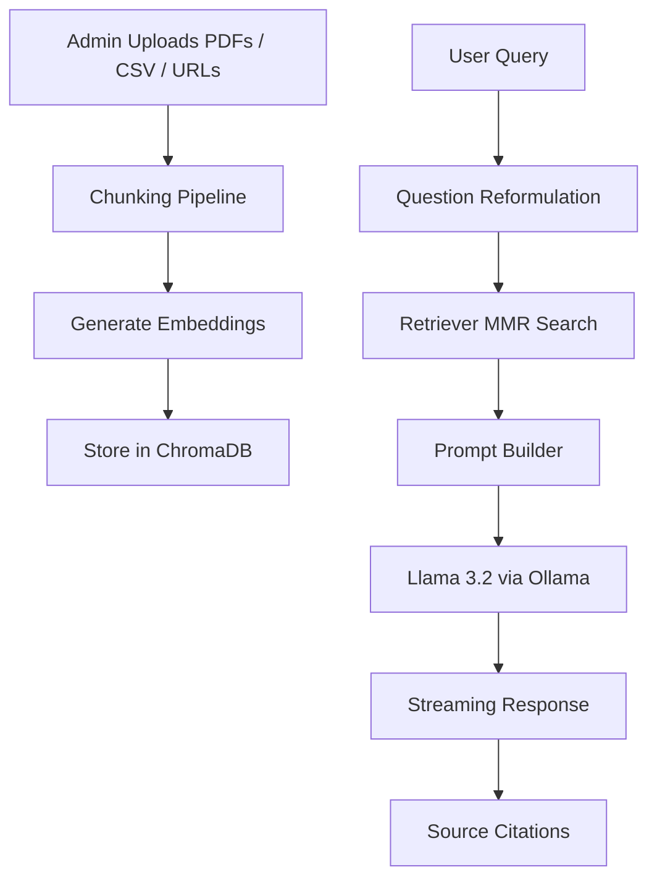

# 🎓 SGSITS AI Academic Assistant

<div align="center">


### Production-Ready AI Assistant for Institutional Knowledge Retrieval

A fully local Retrieval-Augmented Generation (RAG) chatbot designed for **SGSITS** to answer academic and administrative queries using institutional documents, FAQs, and website content.

</div>

---

## 🚀 Overview

The **SGSITS AI Academic Assistant** is an enterprise-grade college chatbot that enables students and staff to query institutional knowledge in natural language.

Built with a **fully local AI stack**, it ensures:

* 🔒 **100% Local Inference** — No OpenAI/API dependency
* 📚 **Grounded Responses** — Answers strictly from ingested knowledge
* ⚡ **Streaming Response Generation** — Real-time token-by-token output
* 🧠 **Context-Aware Multi-Turn Conversations**
* 📌 **Automatic Source Citation Generation**
* 🛡 **Protected Admin Panel with Secure API-Key Access**

---

## ✨ Core Features

### 🤖 Intelligent RAG Pipeline

* Conversational Retrieval-Augmented Generation
* Follow-up Question Reformulation
* Acronym Expansion (`CSE → Computer Science Engineering`)
* MMR-based Diverse Retrieval Strategy
* Semantic Search over Institutional Knowledge

---

### 📂 Multi-Source Knowledge Ingestion

* Upload PDF Documents
* Upload FAQ CSV Files (`Question`,`Answer`)
* Scrape Dynamic Website URLs via Selenium
* Semantic / Structural Chunking Support

---

### 🔐 Admin Management Dashboard

* Secure Admin Login
* Protected Ingestion Endpoints via API Key
* View All Ingested Sources
* Delete Knowledge Sources
* Re-Ingest / Update Website Sources
* Live Backend API Health Monitoring

---

### ⚡ Performance Optimizations

* SQLite LLM Cache for Instant Repeat Responses
* Background Task Processing for Heavy Ingestion
* Streaming LLM Responses
* Structured Logging + Latency Tracking

---

## 🏗 System Architecture



---

## 🛠 Tech Stack

| Layer                | Technology               |
| -------------------- | ------------------------ |
| **Frontend (User)**  | Streamlit                |
| **Frontend (Admin)** | Streamlit                |
| **Backend API**      | FastAPI                  |
| **LLM Runtime**      | Ollama                   |
| **Language Model**   | Llama 3.2                |
| **Embedding Model**  | Nomic-Embed-Text         |
| **Vector Database**  | ChromaDB                 |
| **RAG Framework**    | LangChain                |
| **Web Scraping**     | Selenium / WebBaseLoader |
| **Caching**          | SQLiteCache              |
| **Logging**          | Python Logging           |

---

## 📁 Project Structure

```bash
College-Chatbot/
│
├── backend/
│   ├── app/
│   │   ├── main.py
│   │   ├── llm.py
│   │   ├── rag.py
│   │   ├── schemas.py
│   │   └── logger.py
│   │
│   ├── data/uploads/
│   └── vectorstore/
│
├── frontend/
│   ├── streamlit_app.py
│   └── admin.py
│
├── .env
├── requirements.txt
└── README.md
```

---

## ⚙ Installation & Setup

### 1️⃣ Clone Repository

```bash
git clone https://github.com/your-username/College-Chatbot.git
cd College-Chatbot
```

---

### 2️⃣ Create Virtual Environment

```bash
python -m venv venv
```

#### Activate

**Windows**

```bash
.\venv\Scripts\activate
```

**Linux / Mac**

```bash
source venv/bin/activate
```

---

### 3️⃣ Install Dependencies

```bash
pip install -r requirements.txt
```

---

### 4️⃣ Install Ollama Models

```bash
ollama pull llama3.2
ollama pull nomic-embed-text
```

---

### 5️⃣ Create `.env`

```env
ADMIN_API_KEY=your_secure_api_key_here
```

---

## ▶ Running the Project

---

### Start Ollama

```bash
ollama serve
```

---

### Start Backend

```bash
cd backend
uvicorn app.main:app --reload
```

Backend Docs:

```text
http://127.0.0.1:8000/docs
```

---

### Start User Chat Interface

```bash
cd frontend
streamlit run streamlit_app.py
```

---

### Start Admin Dashboard

```bash
cd frontend
streamlit run admin.py
```

---

## 🔐 Admin Credentials

### Admin Panel Password

```text
sgsits@admin123
```

### Backend API Key

Configured via:

```env
ADMIN_API_KEY=your_secure_api_key_here
```

---

## 📡 API Endpoints

| Method | Endpoint         | Description          |
| ------ | ---------------- | -------------------- |
| `POST` | `/ask-pdf`       | Ask chatbot question |
| `POST` | `/upload-pdf`    | Upload PDF           |
| `POST` | `/upload-csv`    | Upload FAQ CSV       |
| `POST` | `/upload-url`    | Ingest Website       |
| `POST` | `/update-url`    | Re-Ingest Website    |
| `POST` | `/delete-source` | Delete Source        |
| `GET`  | `/list-sources`  | List All Sources     |

---

## 🧠 Advanced RAG Features

### Query Reformulation

Transforms follow-up questions into standalone searchable queries.

**Example:**

```text
User: What is CSE fee?
→ Reformulated:
What is the fee for Computer Science Engineering at SGSITS?
```

---

### Semantic Chunking

PDFs are chunked by **meaning/topic boundaries** rather than fixed text windows.

---

### MMR Retrieval

Ensures retrieved chunks are:

* Relevant
* Diverse
* Non-Redundant

---

### Response Streaming

Tokens stream live to frontend for better UX.

---

## 📊 Logging & Monitoring

Backend logs include:

* API Latency
* LLM Time-To-First-Token
* Retrieval / Ingestion Events
* Errors / Exceptions

Saved in:

```text
chatbot_backend.log
```

---

## 🔒 Security Features

* API-Key Protected Admin Endpoints
* Input Validation & Sanitization
* CSV Schema Validation
* Prompt Bombing Prevention
* Safe URL Update Logic
* Duplicate Source Prevention

---

## 🚧 Future Improvements

* Role-Based Admin Authentication
* Docker Deployment
* PostgreSQL Metadata Store
* Hybrid Search (BM25 + Vector)
* Analytics Dashboard
* User Feedback Collection

---

## 👨‍💻 Contributors

* **Vedant Chitlangia**
* **Anmay Rai**
* **Sanrachna Singh**
* **Arjun Gugoriya**


---

## 📜 License

This project is intended for academic/institutional use.

---

<div align="center">

### ⭐ If you found this project useful, consider starring the repository!

</div>
